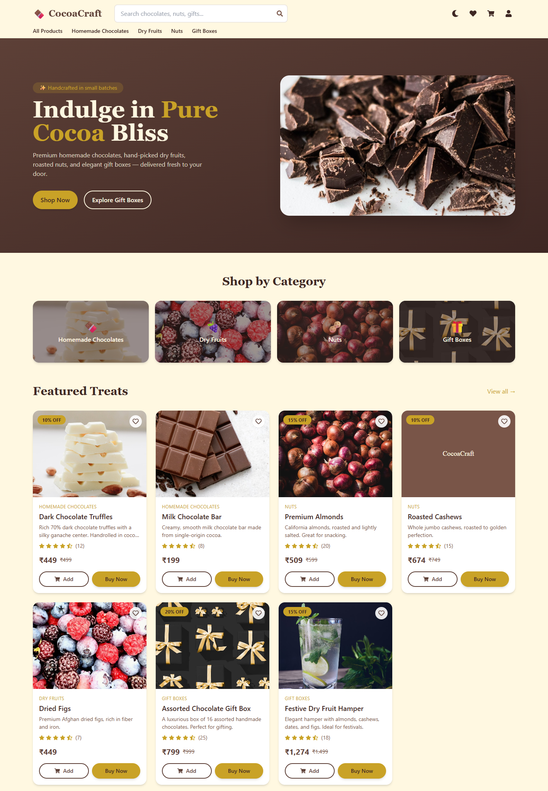
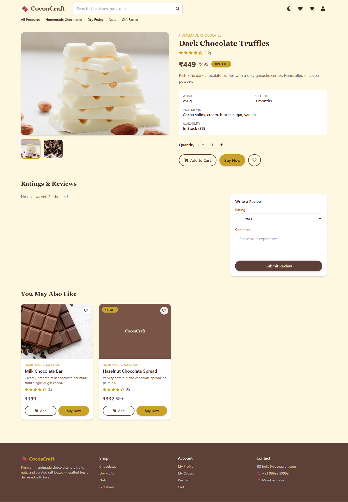
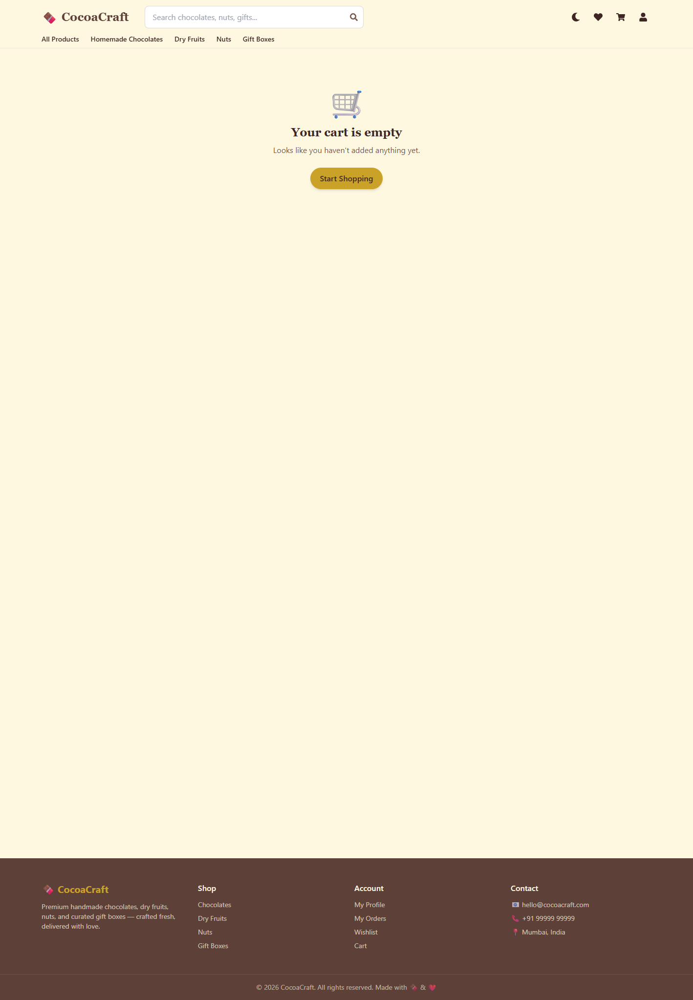
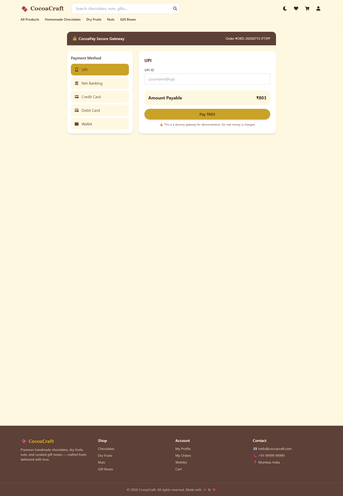
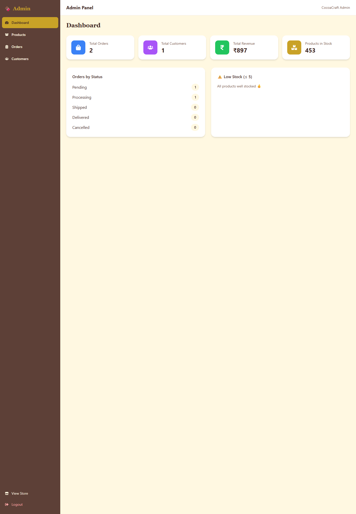
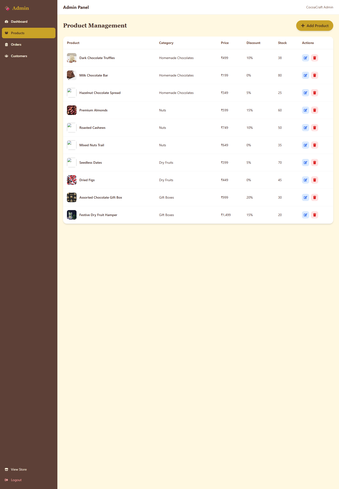

# ChocoNut - Mobile App (Choclate_mobile_app)

ChocoNut is a cross-platform Flutter mobile application (Android & iOS)
for "Home Made Chocolates & Nuts". This repository contains an existing
web/frontend and backend, and a Flutter mobile app inside the `mobile/`
folder.

Repository: https://github.com/sangeeta78/Choclate_mobile_app

Contents
- `backend/` - existing backend services.
- `frontend/` - existing web frontend.
- `mobile/` - Flutter mobile application (Android & iOS).

This README documents how to set up your environment, build the app,
prepare releases and connect Firebase services. Follow the steps below
to run and package the mobile app.

## Prerequisites

- Git
- Flutter (stable). Recommended: latest stable channel. See https://flutter.dev
- Android Studio (for Android SDK and emulator)
- Xcode (macOS) for building iOS
- A GitHub account with push access to this repository

On Windows, ensure you set the `ANDROID_HOME` or `ANDROID_SDK_ROOT` env var
after installing Android Studio.

## Project structure

- Mobile app root: [mobile](mobile)
- Main entrypoint: `mobile/lib/main.dart`

## Quick setup (local)

1. Clone the repo (if not already):

```bash
git clone https://github.com/sangeeta78/Choclate_mobile_app.git
cd Choclate_mobile_app
```

2. Install Flutter and verify:

```bash
flutter --version
flutter doctor
```

3. Install packages and analyze the mobile app:

```bash
cd mobile
flutter pub get
flutter analyze
```

4. Run on a connected device or emulator:

```bash
# Android
flutter run -d emulator-5554

# Windows (desktop)
flutter run -d windows

# Chrome (web) - for quick UI check
flutter run -d chrome
```

## Build Android

Install Android Studio and the SDK, then set `ANDROID_HOME`/`ANDROID_SDK_ROOT`.
After that, from the `mobile` folder run:

```bash
# Debug APK
flutter build apk --debug

# Release APK
flutter build apk --release

# Android App Bundle (recommended for Play Store)
flutter build appbundle --release
```

Note: This environment currently does not include the Android SDK. If you
see `No Android SDK found`, install Android Studio and SDK then re-run
`flutter doctor`.

## Build iOS

On macOS with Xcode installed, from `mobile`:

```bash
flutter build ios --no-codesign
# To build archive and sign, open ios/Runner.xcworkspace in Xcode
# and follow Apple signing flow.
```

## Firebase integration (recommended)

This app is scaffolded to use Firebase services (Auth, Firestore, Storage,
Messaging, Analytics). Steps to integrate:

1. Create a project at https://console.firebase.google.com
2. Add Android app in Firebase console:
   - Android package name: use your app id (e.g. com.yourcompany.choconut)
   - Download `google-services.json`
   - Place it at `mobile/android/app/google-services.json`
3. Add iOS app in Firebase console:
   - iOS bundle id: your app bundle identifier
   - Download `GoogleService-Info.plist`
   - Add it to `mobile/ios/Runner/` and include it in Xcode
4. Add Firebase SDK packages to `pubspec.yaml` (example):

```yaml
dependencies:
  firebase_core: ^2.0.0
  firebase_auth: ^4.0.0
  cloud_firestore: ^4.0.0
  firebase_storage: ^11.0.0
  firebase_messaging: ^14.0.0
  firebase_analytics: ^10.0.0
  firebase_crashlytics: ^3.0.0
```

5. Initialize Firebase in `main.dart` before `runApp()`:

```dart
import 'package:firebase_core/firebase_core.dart';

void main() async {
  WidgetsFlutterBinding.ensureInitialized();
  await Firebase.initializeApp();
  runApp(const ChocoNutApp());
}
```

6. Follow platform-specific setup docs for additional Android Gradle
   configuration and iOS Pod installs: https://firebase.flutter.dev/docs/overview

## Dummy Payment Gateway

This project uses a dummy payment flow (no real payment provider).
The expected behavior implemented in the mobile app:

- Show processing animation for 3 seconds
- Generate random Transaction ID / Order ID locally
- Show payment success and save order to Firestore (when integrated)

Replace the dummy logic with a real payment provider only when ready.

## Linting, formatting and tests

```bash
flutter analyze
flutter format .
flutter test
```

## Continuous Integration / Release notes

- For Play Store: create signing key (`key.jks`), add signing config to
  `android/key.properties` and `android/app/build.gradle`.
- For App Store: create provisioning profile and certificates in Apple
  Developer portal. Use Xcode to manage signing.

## Commit and push changes

From repo root:

```bash
git add .
git commit -m "Add/Update mobile app and README"
git push origin main
```

## Where the mobile app lives

The working Flutter project is in: [mobile](mobile) and main entrypoint is
`mobile/lib/main.dart`.

## Next recommended steps

1. Install Android Studio and configure SDK for Android builds.
2. On macOS, install Xcode for iOS build and signing.
3. Create a Firebase project and add platform apps; drop the config files
   into `mobile/android/app/` and `mobile/ios/Runner/`.
4. Replace the dummy payment logic with a real payment provider when
   ready (Stripe, Razorpay, Paytm, etc.)

## License

Add your preferred license file (e.g., `LICENSE`) to the repository.

----
If you'd like, I can:
- add the Firebase packages and minimal initialization code now,
- prepare Android signing configuration (keystore generation) instructions,
- or create a GitHub Actions workflow for build artifacts.

# 🍫 CocoaCraft — Homemade Chocolate & Nuts Store

A modern, responsive **full-stack MERN e-commerce application** for a premium homemade
chocolate, dry-fruits, nuts and gift-box brand. It has a complete **customer storefront**,
a **dummy payment gateway** (UPI / Net Banking / Cards / Wallet), and a secure **admin panel**.

> 💡 The payment gateway is **fully simulated** — no real payment provider is integrated and
> no money is ever charged.

**Repository:** https://github.com/sangeeta78/Nutch_Choclate_App

---

## 📸 Screenshots

| Home | Product Details |
|------|-----------------|
|  |  |

| Cart | Dummy Payment Gateway |
|------|-----------------------|
|  |  |

| Admin Dashboard | Admin — Product Management |
|-----------------|----------------------------|
|  |  |

---

## 📑 Table of Contents

1. [Screenshots](#-screenshots)
2. [Tech Stack](#-tech-stack)
3. [Tools You Need to Install](#-tools-you-need-to-install)
4. [Project Structure](#-project-structure)
4. [Step 1 — Clone the Project](#-step-1--clone-the-project)
5. [Step 2 — Run the Backend](#-step-2--run-the-backend)
6. [Step 3 — Run the Frontend](#-step-3--run-the-frontend)
7. [Step 4 — Open & Log In](#-step-4--open--log-in)
8. [Using the Store (Customer)](#-using-the-store-customer)
9. [Using the Admin Panel](#-using-the-admin-panel)
   - [How to add a product & upload a new image](#how-to-add-a-product--upload-a-new-image)
   - [How to edit a product / replace its image](#how-to-edit-a-product--replace-its-image)
10. [Making Changes & Committing to Git](#-making-changes--committing-to-git)
11. [Coupon Codes](#-coupon-codes)
12. [API Reference](#-api-reference)
13. [Troubleshooting](#-troubleshooting)
14. [License](#-license)

---

## ✨ Tech Stack

| Layer     | Technology                                     |
|-----------|------------------------------------------------|
| Frontend  | React 18 (Vite) + Tailwind CSS + React Router  |
| Backend   | Node.js + Express (ES modules)                 |
| Database  | MongoDB + Mongoose                             |
| Auth      | JWT (Bearer tokens) + bcrypt                   |
| Payments  | Dummy simulator (UPI, Net Banking, Cards, Wallet) |
| Mobile    | Flutter (in `mobile/`, optional)               |

---

## 🧰 Tools You Need to Install

Install these **once** on your computer. Windows commands using `winget` are shown; on macOS
use `brew`, on Linux use your package manager.

| Tool | Why it's needed | Download / Install |
|------|-----------------|--------------------|
| **Git** | Clone the repo & commit changes | https://git-scm.com/downloads  ·  `winget install Git.Git` |
| **Node.js 18+** (includes npm) | Runs the backend & builds the frontend | https://nodejs.org  ·  `winget install OpenJS.NodeJS.LTS` |
| **MongoDB Community Server** | The database | https://www.mongodb.com/try/download/community  ·  `winget install MongoDB.Server` |
| **A code editor** (VS Code) | Edit the code | https://code.visualstudio.com |
| **GitHub CLI** *(optional)* | Easy GitHub auth & repo creation | https://cli.github.com  ·  `winget install GitHub.cli` |
| **Flutter** *(only for the mobile app)* | Build/run `mobile/` | https://docs.flutter.dev/get-started/install |

> Instead of installing MongoDB locally you can use a **free MongoDB Atlas** cloud database
> (https://www.mongodb.com/atlas) and just paste its connection string into your `.env`.

### Verify the installs

Open a terminal and run:

```bash
git --version
node --version
npm --version
```

Check MongoDB is running (Windows installs it as an auto-start service called **MongoDB**):

```powershell
Get-Service MongoDB          # Status should be "Running"
```

---

## 📁 Project Structure

```
Nutch_Choclate_App/
├── backend/                 # Node + Express REST API
│   ├── config/              # MongoDB connection
│   ├── controllers/         # Business logic (auth, products, orders, payment, admin…)
│   ├── middleware/          # auth guard, error handler, validation, image upload
│   ├── models/              # Mongoose schemas (User, Product, Order, Payment, Category)
│   ├── routes/              # Express routers
│   ├── utils/               # token, helpers, DB seed script
│   ├── uploads/             # uploaded product images (served at /uploads)
│   ├── .env.example         # environment template — copy to .env
│   └── server.js            # entry point
│
├── frontend/                # React + Vite + Tailwind app
│   └── src/
│       ├── api/             # axios instance
│       ├── components/      # Navbar, Footer, ProductCard, Rating, Loader…
│       ├── context/         # Auth, Cart, Wishlist, Theme providers
│       ├── pages/           # storefront pages
│       │   └── admin/       # admin panel pages
│       └── utils/           # formatters
│
├── mobile/                  # Flutter mobile app (optional)
└── README.md
```

---

## 📥 Step 1 — Clone the Project

```bash
# Clone your repository
git clone https://github.com/sangeeta78/Nutch_Choclate_App.git

# Go into the project folder
cd Nutch_Choclate_App
```

---

## 🖥️ Step 2 — Run the Backend

Open a terminal in the project folder:

```bash
cd backend

# 1. Install dependencies
npm install

# 2. Create your environment file from the template
cp .env.example .env          # Windows PowerShell:  Copy-Item .env.example .env
```

Open `backend/.env` in your editor and set at least these values:

```env
PORT=5000
MONGO_URI=mongodb://127.0.0.1:27017/cocoacraft   # or your Atlas connection string
JWT_SECRET=change_this_to_a_long_random_string
CLIENT_URL=http://localhost:5173
ADMIN_EMAIL=admin@cocoacraft.com
ADMIN_PASSWORD=Admin@123
```

Seed the database with sample products, categories, an admin account and a demo customer:

```bash
npm run seed
```

Start the API server:

```bash
npm run dev      # development, auto-reloads on changes
# or
npm start        # production mode
```

✅ Backend is now at **http://localhost:5000** (health check: open `http://localhost:5000/api/health`).

---

## 🎨 Step 3 — Run the Frontend

Open a **second terminal**:

```bash
cd frontend

# Install dependencies
npm install

# Start the dev server
npm run dev
```

✅ App is now at **http://localhost:5173**. Vite automatically proxies `/api` and `/uploads`
to the backend, so you don't need any extra CORS setup during development.

> **Windows note:** if `npm install` warns that install scripts were skipped for **esbuild**,
> run `npm approve-scripts esbuild` once, then `npm run dev` again.

---

## 🔓 Step 4 — Open & Log In

Open **http://localhost:5173** in your browser.

Click the **person icon (👤)** in the top-right navbar → **Login**, and use one of the seeded
accounts:

| Role         | Email                     | Password      | What you can do                    |
|--------------|---------------------------|---------------|------------------------------------|
| **Customer** | customer@cocoacraft.com   | `Customer@123`| Shop, cart, checkout, orders       |
| **Admin**    | admin@cocoacraft.com      | `Admin@123`   | Dashboard, manage products/orders  |

After logging in as **admin**, open the **Admin Panel** from the 👤 account menu (or go to
**http://localhost:5173/admin**).

You can also **Register** a brand-new customer account from the login screen.

---

## 🛒 Using the Store (Customer)

1. **Browse** products on the home page or **All Products**; use the **search bar**, **category
   filters**, and **sort** (price / rating) options.
2. Click a product to see **details**, image gallery, ingredients, reviews and related items.
3. **Add to Cart** or **Buy Now** → open the **Cart** (🛒 icon) to change quantities or remove items.
4. **Proceed to Checkout** → fill in delivery details → optionally apply a **coupon code**.
5. **Proceed to Payment** → choose **UPI / Net Banking / Credit Card / Debit Card / Wallet** →
   watch the 3-second processing animation → land on the **Order Success** page with your
   Order ID & Transaction ID.
6. View past orders under **My Orders**, open any order to **print the invoice**, and use the
   **♥ Wishlist** and 🌙 **dark-mode** toggle in the navbar.

---

## 🛠️ Using the Admin Panel

Log in with the **admin** account, then go to **/admin**. The sidebar has:

- **Dashboard** — total orders, customers, revenue, products in stock, low-stock alerts.
- **Products** — create / edit / delete products, upload images, set price/discount/stock.
- **Orders** — view all orders and change their status (Pending → Processing → Shipped → Delivered / Cancelled).
- **Customers** — search customers and view their order history.

### How to add a product & upload a new image

1. Log in as **admin** → open **Admin Panel** → click **Products** in the sidebar.
2. Click the **➕ Add Product** button (top-right).
3. Fill in the fields:
   - **Product Name**, **Category** (Homemade Chocolates / Dry Fruits / Nuts / Gift Boxes)
   - **Description**, **Ingredients**, **Weight** (e.g. `250g`), **Shelf Life** (e.g. `3 months`)
   - **Price (₹)**, **Discount (%)**, **Stock**
4. Add product images in **either** (or both) of two ways:
   - **Image URLs** — paste one or more image links, comma-separated, into the *Image URLs* field, **or**
   - **Upload Images** — click **"Or Upload Images"** and select one or more image files from your
     computer (JPG/PNG/WebP, up to 5 files, max 5 MB each). Uploaded files are saved to
     `backend/uploads/` and served automatically.
5. *(Optional)* tick **Featured product** to show it on the home page.
6. Click **Create Product**. The new product appears immediately in the list and on the storefront.

### How to edit a product / replace its image

1. In **Admin Panel → Products**, find the product and click the **✏️ Edit** (blue) button.
2. Change any field (price, stock, description, etc.).
3. To **add more images**, upload new files or add more URLs — they are appended to the product’s
   gallery. (Existing image URLs are shown comma-separated in the *Image URLs* box; edit that list
   to remove or reorder images.)
4. Click **Update Product** to save.
5. To remove a product entirely, click the **🗑️ Delete** (red) button and confirm.

> **Where do uploaded images live?** Files you upload are stored in `backend/uploads/` and served
> by the backend at `http://localhost:5000/uploads/<filename>`. This folder is **git-ignored** (only
> a `.gitkeep` is committed), so your uploaded images stay on your machine and aren’t pushed to GitHub.

---

## 🔁 Making Changes & Committing to Git

**Tools required:** **Git** (and a GitHub account). The **GitHub CLI** (`gh`) is optional but makes
authentication easier.

### One-time setup

```bash
# Tell git who you are (only needed once per machine)
git config --global user.name  "Your Name"
git config --global user.email "you@example.com"
```

Authenticate with GitHub so you can push. Easiest way (recommended):

```bash
gh auth login          # choose GitHub.com → HTTPS → Login with a web browser
```

*(Without the GitHub CLI, Git will prompt for your GitHub username and a **Personal Access Token**
the first time you push — create one at https://github.com/settings/tokens with `repo` scope.)*

### Everyday workflow

```bash
# 1. See what you changed
git status

# 2. Stage your changes (all of them)
git add -A
#    …or a specific file
git add frontend/src/pages/Home.jsx

# 3. Commit with a clear message
git commit -m "Update home page hero text"

# 4. Push to GitHub
git push origin main
```

### Working safely on a feature (recommended)

```bash
# Create and switch to a new branch
git checkout -b my-new-feature

# ...make changes, then:
git add -A
git commit -m "Add gift-wrap option at checkout"
git push -u origin my-new-feature
# Then open a Pull Request on GitHub to merge into main.
```

### Pulling the latest changes

```bash
git pull origin main
```

> ⚠️ **Never commit secrets.** The `.env` file, `node_modules/`, build output and uploaded images
> are already listed in `.gitignore` and will **not** be committed. Change `JWT_SECRET` and the demo
> passwords before deploying anywhere real.

---

## 🎟️ Coupon Codes

Try these at checkout:

| Code        | Discount |
|-------------|----------|
| `SWEET10`   | 10% off  |
| `COCOA20`   | 20% off  |
| `FESTIVE25` | 25% off  |

Pricing rules: **5% GST**, **₹49 delivery** (free on orders above **₹999**). All totals are
calculated **server-side** so prices can’t be tampered with from the browser.

---

## 🔌 API Reference

Base URL: `http://localhost:5000/api`

| Method | Endpoint                          | Access   | Purpose                        |
|--------|-----------------------------------|----------|--------------------------------|
| POST   | `/auth/register`                  | Public   | Register                       |
| POST   | `/auth/login`                     | Public   | Login                          |
| POST   | `/auth/forgot-password`           | Public   | Request reset token (mock)     |
| POST   | `/auth/reset-password`            | Public   | Reset password                 |
| GET    | `/products`                       | Public   | List (search/filter/sort/page) |
| GET    | `/products/featured`              | Public   | Featured products              |
| GET    | `/products/:id`                   | Public   | Product details                |
| GET    | `/products/:id/related`           | Public   | Related products               |
| POST   | `/products/:id/reviews`           | Private  | Add review                     |
| POST   | `/products`                       | Admin    | Create product (multipart)     |
| PUT    | `/products/:id`                   | Admin    | Update product                 |
| DELETE | `/products/:id`                   | Admin    | Delete product                 |
| GET    | `/categories`                     | Public   | List categories                |
| POST   | `/orders/preview`                 | Private  | Price preview + coupon         |
| POST   | `/orders`                         | Private  | Create order                   |
| GET    | `/orders/my`                      | Private  | My orders                      |
| GET    | `/orders/:id`                     | Private  | Order details                  |
| PUT    | `/orders/:id/cancel`              | Private  | Cancel order                   |
| POST   | `/payments/process`               | Private  | Simulate payment               |
| GET    | `/admin/stats`                    | Admin    | Dashboard stats                |
| GET    | `/admin/orders`                   | Admin    | All orders                     |
| PUT    | `/admin/orders/:id/status`        | Admin    | Update order status            |
| GET    | `/admin/customers`                | Admin    | List/search customers          |
| GET    | `/admin/customers/:id/orders`     | Admin    | Customer order history         |
| GET/PUT| `/users/profile`                  | Private  | Get / update profile           |
| GET/POST | `/users/wishlist[/:id]`         | Private  | Wishlist                       |

---

## 🩺 Troubleshooting

| Problem | Fix |
|---------|-----|
| `MongoDB connection error` | Ensure MongoDB is running (`Get-Service MongoDB`) or that your Atlas `MONGO_URI` is correct in `backend/.env`. |
| `node`/`npm` not recognized | Reopen the terminal after installing Node so the PATH refreshes. |
| Frontend won’t start / esbuild error (Windows) | Run `npm approve-scripts esbuild` in `frontend/`, then `npm run dev`. |
| Port already in use | Change `PORT` in `backend/.env`, or stop the process using the port. |
| Product images don’t show | Ensure the backend is running (images are served from `http://localhost:5000/uploads`). |
| Login fails right after setup | Run `npm run seed` in `backend/` to (re)create the demo accounts. |

---

## 📄 License

Released under the **MIT License** — see [LICENSE](LICENSE).
